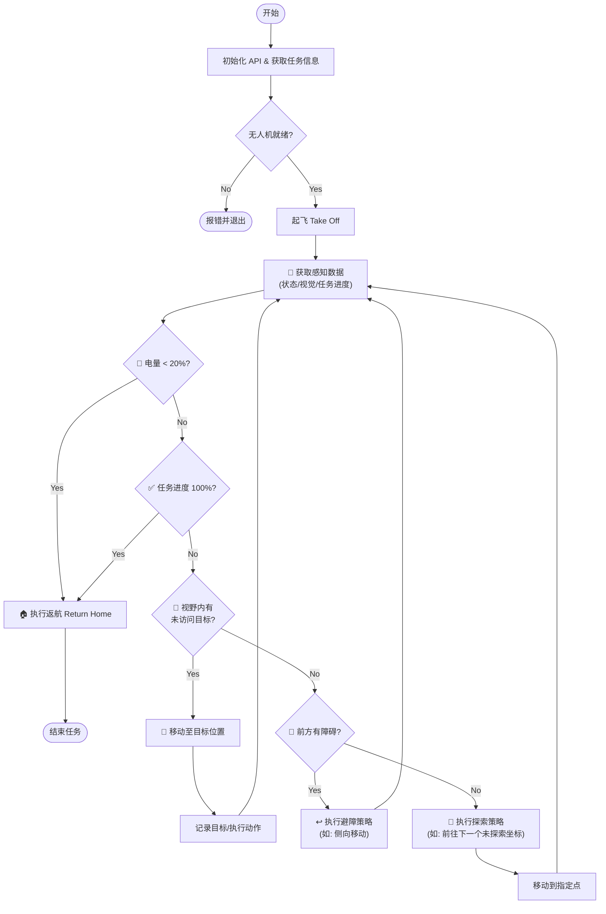

```mermaid
graph TD
    %% 初始化阶段
    Start([开始]) --> Init[初始化 API & 获取任务信息]
    Init --> CheckReady{无人机就绪?}
    CheckReady -- No --> Error([报错并退出])
    CheckReady -- Yes --> TakeOff[起飞 Take Off]
    
    %% 循环感知阶段
    %% 修复点 1: 加双引号
    TakeOff --> Observe["👀 获取感知数据<br/>(状态/视觉/任务进度)"]
    
    %% 决策树 (优先级逻辑)
    Observe --> CheckBattery{"🔋 电量 < 20%?"}
    
    %% 分支 1: 生存
    CheckBattery -- Yes --> ReturnHome[🏠 执行返航 Return Home]
    ReturnHome --> End([结束任务])
    
    %% 分支 2: 任务完成
    CheckBattery -- No --> CheckTask{"✅ 任务进度 100%?"}
    CheckTask -- Yes --> ReturnHome
    
    %% 分支 3: 发现目标
    %% 修复点 2: 加双引号（建议养成习惯，有特殊符号就加）
    CheckTask -- No --> CheckTarget{"🎯 视野内有<br/>未访问目标?"}
    CheckTarget -- Yes --> MoveToTarget[🚀 移动至目标位置]
    MoveToTarget --> RecordTarget[记录目标/执行动作]
    RecordTarget --> Observe
    
    %% 分支 4: 发现障碍
    CheckTarget -- No --> CheckObstacle{"🚧 前方有障碍?"}
    %% 修复点 3: 加双引号
    CheckObstacle -- Yes --> AvoidObstacle["↩️ 执行避障策略<br/>(如: 侧向移动)"]
    AvoidObstacle --> Observe
    
    %% 分支 5: 纯探索 (默认状态)
    %% 修复点 4: 加双引号
    CheckObstacle -- No --> ExploreStrategy["🧭 执行探索策略<br/>(如: 前往下一个未探索坐标)"]
    ExploreStrategy --> MoveToExplore[移动到指定点]
    MoveToExplore --> Observe
```