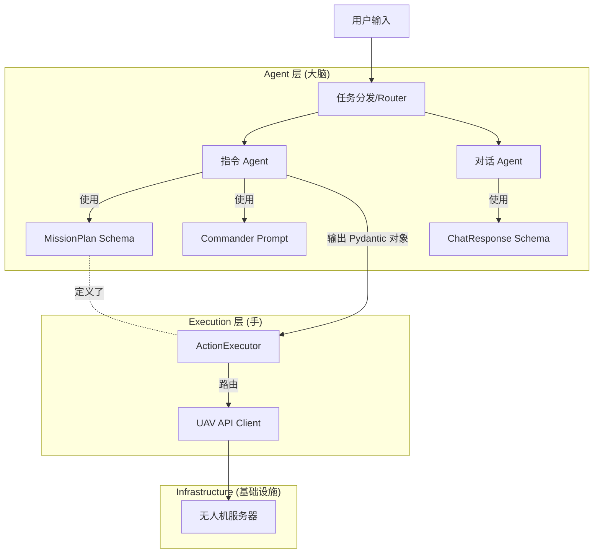

```mermaid
graph TD
    User[用户输入] --> Dispatcher[任务分发/Router]
    
    subgraph "Agent 层 (大脑)"
        Dispatcher --> CmdAgent[指令 Agent]
        Dispatcher --> ChatAgent[对话 Agent]
        
        CmdAgent -- 使用 --> Schema1[MissionPlan Schema]
        CmdAgent -- 使用 --> Prompt1[Commander Prompt]
        
        ChatAgent -- 使用 --> Schema2[ChatResponse Schema]
    end
    
    subgraph "Execution 层 (手)"
        CmdAgent -- 输出 Pydantic 对象 --> Executor[ActionExecutor]
        Executor -- 路由 --> API[UAV API Client]
    end
    
    subgraph "Infrastructure (基础设施)"
        API --> Server[无人机服务器]
        Schema1 -. 定义了 .- Executor
    end
```